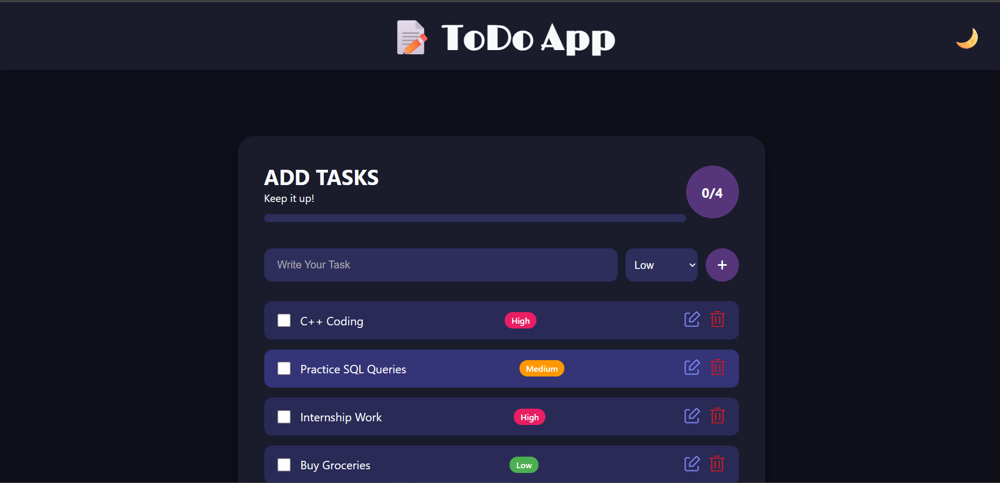
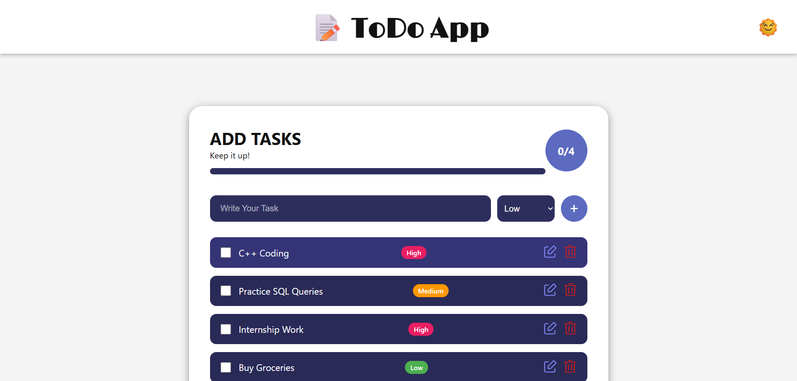
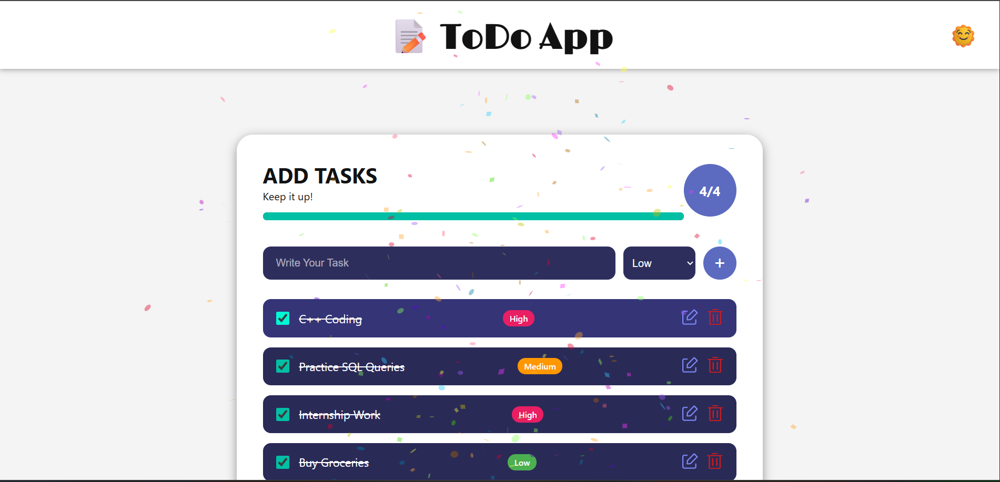

# 📝 TO-DO LIST

A simple and interactive **To-Do List** web application built using **HTML**, **CSS**, and **JavaScript**. It allows users to manage daily tasks efficiently — add, mark as completed, and delete tasks in a clean and responsive interface.

---

## 🚀 Features

- ✅ Add new tasks easily
- 🗑️ Delete tasks with a single click
- ✔️ Mark tasks as completed
- 💾 Data stored in local storage (optional enhancement)
- 💡 Clean and minimal UI
- 📱 Responsive design (works on mobile, tablet, and desktop)

---

## 🛠️ Built With

- **HTML5** – Structure of the application  
- **CSS3** – Styling and layout (including responsive design)  
- **JavaScript** – App logic and interactivity  

---

## 📸 Screenshots

### 🖼️ Screenshot 1 – Home Page 

### 🖼️ Screenshot 2 – User vs Computer Scoreboard  

### 🖼️ Screenshot 3 – Tasks Completed 

---
## 📌 Future Enhancements

- ✏️ **Add edit functionality** for tasks  
- ⏰ **Set deadlines and reminders** for upcoming tasks  
- 🗂️ **Categorize tasks** (e.g., Work, Personal, Urgent)  
- ☁️ **Sync with cloud or account-based storage**

---
## 📂 Folder Structure
TO_DO_LIST/
- ├── index.html
- ├── style.css
- ├── script.js
- └── README.md

---
## ⚙️ Functionality Details

### 🌗 Theme Toggle
- A switch allows users to toggle between light and dark themes.
- User's theme preference is saved using **Local Storage**.

### 🔺 Task Priority
- While adding a task, users can set a priority: **High**, **Medium**, or **Low**.
- Tasks display colored badges or icons to indicate priority.
- (Optional enhancement) Tasks can be sorted by priority level.

---
## 📝 Author
- [Avanti Chinchone](https://github.com/Avanti-Chinchone2003)
